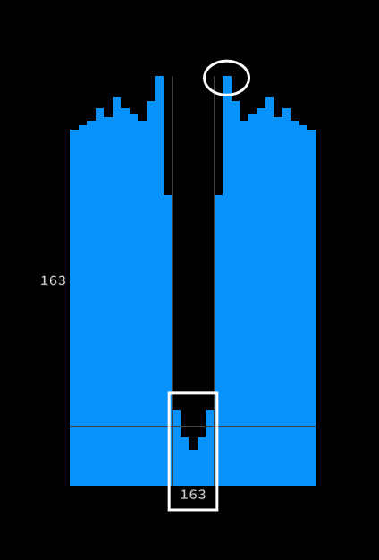
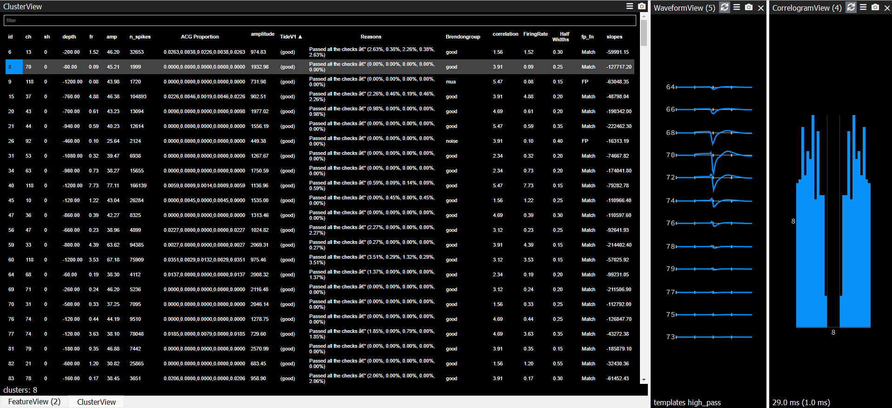

# SpikeCleaner

**Autocuration of Neural Clusters using Adjustable Thresholds**

## Contributors
- Diksha Zutshi
- Dr. Brendon O Watson
- David Kim  
- Dr. Jeremiah Hartner
- Deniz Kirca

## Overview

SpikeCleaner reduces manual curation time by combining heuristic metrics (firing rate, amplitude, half-width, slope, ISI/ACG rules) with auto-labeling to flag Good / MUA / Noise clusters. It can read Kilosort outputs (.npy) files, generate curation labels along with feature metrics for each cluster compatible with Phy.

## Repository Structure

```
SpikeCleaner/
├── dz_classifyUnitsAll.m
├── dz_Curate.m
├── dz_runFirst.m
├── HelperFunctions/
│   ├── dz_getWaveform.m
│   ├── dz_filterWaveform.m
│   ├── dz_analyzeSpikeType.m
│   ├── dz_autoCorr.m
│   ├── dz_fitPolynomial.m
│   ├── dz_detectPeaksAndTroughs.m
│   ├── getAllExtFiles.m
│   ├── bz_BasenameFromBasepath.m
│   └── readNPY.m
├── AccuracyMetrics/  # Codes to compare user labels to TIDE created labels
|   |── dz_goodVsRest.m : Good/Single Units Vs Rest
|   |── dz_allCats.m : Comparing all categories Noise/Good/MUA
|   └── dz_neuronalvsNN.m : Comparing Neuronal (MUA+Single Units) Vs Non Neuronal(Noise)
└── readme.md
```

## Installation

```bash
git clone https://github.com/BrendonWatsonLab/SpikeCleaner.git
```
## Setup
- After running Spike Sorting, CD to  you data folder.
- Add SpikeCleaner folder to path in MATLAB: **addpath(genpath('path'))**
- Run **dz_runFirst**: This will create a folder for SpikeCleaner in your data folder, and copy all the necessary files in that from all the subfodlers:**dat file, spike_clusters.npy,spike_times.npy, channel_map.npy,channel_positions.npy, pc_features.npy, templates.npy, spike_templates.npy, whitening_mat.npy,whitening_mat_inv.npy,similar_templates.npy,params.py ** and craetes **parameters.mat** containing information like number channels, sampling rate and animal name.
- Run **dz_classifyUnitsAll()**.
- Thresholds are pre-set but can be updated. We have made two versions available: **lenient** and **strict**. 
- The first  time you run the code, it  is going to create mat files for filtered waveforms and ACGs,which might take some time, and then use them for every consecutive run.
- To be able to  run the comparison codes in  **AccuracyMetrics**, manually curate with PHY in SpikeCleaner folder and then call functions for  **dz_goodVsRest(), dz_allCats(),dz_neuronalvsN()** which will ask you to enter your name, it's necessary for display in PHY for you to compare between your's and SpikeCleaner's labels. It will output Metrics files which will prompt Match/No Match between your's and SpikeCleaners labelling and which will also be imported in PHY and can be used to navigate.

## Dependencies & Requirements

### Inputs
- `spike_clusters.npy` (Output from Kilosort)
- `spike_times.npy` (Output from Kilosort)
- `parameters.mat` (Output from dz_runFirst())
- `cluster_group.tsv` (PHY manual curation labels)

### Outputs
- `cluster_SpikeCleaner.tsv`
- `cluster_Spikereasons.tsv`
- `halfwidths.tsv`
- `slopes.tsv`
- `correlation.tsv`
- `amplitudes.tsv`
- `GoodvsRest_username.tsv`
- `allcat_username.tsv`
- `NvsNN_username.tsv`

## Features

- **Noise Detection**: Detects low-firing clusters and labels them as Noise
- **Waveform Extraction**: Extracts spike waveforms (±2 ms)
- **Quality Metrics**: Computes waveform quality metrics and decides between Biological clusters and Noise:
  - Amplitude
  - Half Width
  - Slope
- **Noise Detection**: Flags Noisy Units using autocorrelogram (ACG), depending on ACG trough-fill.   
- **MUA Detection**: Flags multi-unit activity (MUA) clusters using autocorrelogram (ACG) analysis, with **lenient** or **strict** evaluation modes depending on the allowed level of ISI violations
- **Automatic Classification**: Classifies good single units automatically
- **Phy Compatibility**: Exports Phy-compatible labels (`cluster_SpikeCleaner.tsv`)
- **Metrics Export**: Exports Phy-compatible cluster specific metrics (`halfwidths.tsv`, `slopes.tsv`, `correlation.tsv`, `amplitudes.tsv`)

## Pipeline Flow

### Main Entry Point
- **`dz_classifyUnitsAll.m`**: Call this from your data folder, add the thresholds and run. If no thresholds are not provided it will run on default thresholds. 

**Default Values**:
acgEvaluationMode='lenient' or 'strict'

minHW=0.85;%ms  halfwidth threshold

minAmp=50;%%uV minimum amplitude threshold

maxAmp=2000;%%uV maximum amplitude threshold

minSlope=5e5;%uV/s  minimum slope threshold %5e5uV/s --> 500uV/ms 

firingThreshold=0.05;%hz minimum firing rate threshold

acgallthreshold=0.8;% 80% : threshold for all the center bins compared to the shoulder peak

acgmaxthreshold=1.1;% 110% : threshold for any of the center bins compared to the shoulder peak
            
myThresholds = {acgEvaluationMode, minHW, minAmp, maxAmp, minSlope, firingThreshold, acgallthreshold,acgmaxthreshold}; user can change

**dz_classifyUnitsAll('path to directory', myThresholds)**

### Core Processing (`dz_Curate.m`)
This is the first function that is called upon:

1. **Data Loading**: Loads spike times (`spike_times.npy`), cluster IDs (`spike_clusters.npy`), and `rez.mat`, obtains the active channels and sampling frequency

2. **Low Firing Rate Evaluation**: Internally calls `evaluateLowFiringRates` to check whether clusters fire below the biologically plausible threshold and flag them as Noise

3. **Waveform Processing**:
   - Calls `dz_getWaveform.m` to obtain raw waveforms ±2ms long [Time samples, Active Channels]
   - Calls `dz_filterWaveform.m` to filter the extracted waveforms

4. **Waveform Quality Assessment**: Internally calls `assessWaveformQuality` to extract the quality metrics based on the waveforms (amplitude, slopes, half widths, and correlation of the best channel waveform to all other channels, to check whether cluster waveform looks biological, otherwise flag them as Noise)
   - Calls `dz_detectPeaksAndTroughs.m`, `dz_fitPolynomial.m`, `dz_analyzeSpikeType.m` for extraction of waveform metrics
   
   **Differentiates the Biological Units from Noisy Units:**

   - Uses max and min amplitude allowed on the max channel:

      minAmp=50;%%uV minimum amplitude threshold

      maxAmp=2000;%%uV maximum amplitude threshold

   - Uses max allowed halfwidth

      minHW=0.85;%ms  halfwidth threshold

   - Uses min allowed slope:

      minSlope=5e5;%uV/s  minimum slope threshold %5e5uV/s --> 500uV/ms 

   - Uses correlation between channels:
   
      Correlation >0.95 in more than 80% of channels


5. **ACG Quality Assessment**: Internally calls `assessAcgQuality` to extract the percentage refractory period violations based on ACG. These are the [violations in the 0th +/- 2 bins]/Shoulder peak, giving user the perspective of how low/high these violations are relative to the shoulder peaks. User can opt between strict/lenient thresholds
   - Calls `dz_autoCorr.m` to compute autocorrelograms for each cluster

   **Differentiates the Biological Units from Noisy Units:**

   - Uses the center trough fill:

      acgallthreshold=0.8;% 80% : threshold for all the center bins compared to the shoulder peak

      acgmaxthreshold=1.1;% 110% : threshold for any of the center bins compared to the shoulder peak

   **Differentiates the Multi Activity Units from Single Units:**

   - Uses the center trough fill: using acgEvaluationMode='lenient' or 'strict'

      Strict allows upto 30% voilation and lenient only allows upto 10%

## Outputs

### TSV Files (Data folder)
All TSV file outputs (`cluster_SpikeCleaner.tsv`, `cluster_Spikereasons.tsv`,,`halfwidths.tsv`, `slopes.tsv`, `correlation.tsv`, `amplitudes.tsv`, `GoodvsRest_username.tsv`,`allcat_username.tsv`, `NvsNN_username.tsv` ) are created in the SpikeCleaner folder within the Data folder, which is required to be able to access in PHY.

### MAT Files (Outputs folder)
All MAT file outputs (`datfilename.mat`, `datfilename_filtered.mat`, `datfilenameacg.mat`) are created in the Outputs folder in the TIDEV1 directory.

## Usage

1. Open your data folder that will be your base folder
2. Add SpikeCleaner to path.
3. Call `dz_runFirst()`
4. Call `dz_ClassifyUnitsAll()` and adjust thresholds as needed. The first run would take a very long time because SpikeCleaner would make ACGs and extract waveforms for every cluster and save them in a mat file, every subsequent run would be a few seconds long.
5. Open PHY for manual curation with SpikeCleaner folder as the base.
6. Run Accuracy metrics with SpikeCleaner folder as the base.

## Results

**Figure1: PHY View: Autocorrelogram Classification: It uses shoulder peaks to get the proportions of voilations in the center.**



**Figure2: PHY View: Depicts the view in PHY after importing results from TIDEV1.**


**Figure3: Journey to Acceptance:Shows implementations of all the thresholding rules consecutively to obtain Single Units.**


## Metrics of Match with Expert Users

**Rodents-Grass Rats:** Harald,Hafdan,Canute 
**Neural Recording Information:**

Recording Size: 102 GB

Channels: 128 Channels

Sampling Rate: 20KHz 

Calculated Time: ~5.5 hours long.

**Results were averaged over 2 experts and 3 datasets:**

**Figure4: Metrics Single Units Vs Rest between the algorithm and experts users**


**Figure5: Metrics All categories(SU Vs MUA Vs Noise) between the algorithm and experts users**


**Figure6: Metrics Neuronal(SU+MUA) Vs Non-Neuronal(Noise) between the algorithm and experts users**


## Failure Scenarios
**Figure7: Algorithm at this point can't process edge case of this kind, it will choose one full spike, if it passes all the threshold barriers and ACG has no refractory period voilations, it will consider that as a Good/Single Unit cluster.**


**Figure8: Algorithm at this point can't process edge case of this kind,because it will take 3 points from the spike and classify that based on half amplitude and slope and if it pass checks, algorithm will label it as a Good/Single Unit Cluster.**


## Acknowledgements

Special thanks to  the expert curators: Dr. Brendon Watson & Dr. Jeremiah Hartner.

This work builds on open-source tools such as [Kilosort](https://github.com/MouseLand/Kilosort) and [Phy](https://github.com/cortex-lab/phy).


