# SpikeCleaner

**Autocuration of Neural Clusters using Adjustable Thresholds**

## Contributors
- Diksha Zutshi
- David Kim  
- Dr. Jeremiah Hartner
- Dr. Daniil Berezhnoi
- Anjesh Ghimire
- Dr. Brendon O Watson


## Overview

SpikeCleaner reduces manual curation time by combining heuristic metrics (firing rate, amplitude, half-width, slope, ISI/ACG rules) with auto-labeling to flag Good / MUA / Noise clusters. It can read Kilosort outputs (.npy) files, generate curation labels along with feature metrics for each cluster compatible with Phy.

## Repository Structure

```
SpikeCleaner/
├── dz_classifyUnitsAll.m
├── dz_Curate.m
├── dz_runFirst.m
├── HelperFunctions/
│   ├── dz_getWaveform.m
│   ├── dz_filterWaveform.m
│   ├── dz_extractAcgVariables.m
│   ├── dz_extractWfVariables.m
│   ├── dz_autoCorr.m
│   ├── dz_fitPolynomial.m
│   ├── dz_detectPeaksAndTroughs.m
│   ├── getAllExtFiles.m
│   ├── bz_BasenameFromBasepath.m
│   └── readNPY.m
├── AccuracyMetrics/  # Codes to compare user labels to SpikeCleaner created labels
|   |── dz_goodVsRest.m : Good/Single Units Vs Rest
|   |── dz_allCats.m : Comparing all categories Noise/Good/MUA
|   |── dz_neuronalvsNN.m : Comparing Neuronal (MUA+Single Units) Vs Non Neuronal(Noise)
├── FindThresholds/  # Codes to find thresholds based on your curation and data
|   |── findCorrelationThreshold.m : At and after the set correlation threshold, user starts to think that channels are too correlated: Noise
|   |── findAmplitudeThreshold.m : At and after the set correlation threshold, user starts to think that  the amplitude difference between channels is too much: Noise.
|   |── findHalfWidthThreshold.m : After this threshold user thinks half width of the spike is too wide for the spike to be physiological: Noise
|   |── findSlopeThreshold.m :  Under this threshold user thinks slope of the spike is too low, for the spike to be physiological, spike is too slow: Noise
|   |── findACGallThreshold.m : All ACG Bins need to be lower than this threshold/ this percentage of the shoulder bins: Noise/MUA depending on the data and user's previous curations, labels can be changed based on the results of the plots, which are further explained in the sections below.
└── readme.md
```

## Installation
- Install in your code folder.
```bash
git clone https://github.com/BrendonWatsonLab/SpikeCleaner.git
```
## Setup
- After running Spike Sorting, CD to  you data folder.
- Make sure that your .dat file is of your folder name.
- Add SpikeCleaner folder to path in MATLAB: **addpath(genpath('path'))**
- Run **dz_runFirst**: This will create a folder for SpikeCleaner in your data folder, and copy all the necessary files in that from all the subfodlers:**dat file, spike_clusters.npy,spike_times.npy, channel_map.npy,channel_positions.npy, pc_features.npy, templates.npy, spike_templates.npy, whitening_mat.npy,whitening_mat_inv.npy,similar_templates.npy,params.py ** and creates **parameters.mat** containing information like number channels, sampling rate and animal name.
- Run **dz_classifyUnitsAll()**.
- Thresholds are pre-set but can be updated. We have made two versions available: **lenient** and **strict**. 
- This will ask you the number of channels you want to consider according to your probe and shank geometry.
- The first  time you run the code, it  is going to create mat files for filtered waveforms and ACGs,which might take some time, and then use them for every consecutive run.
- To be able to  run the comparison codes in  **AccuracyMetrics**, manually curate with PHY in SpikeCleaner folder and then call functions for  **dz_goodVsRest(), dz_allCats(),dz_neuronalvsN()** from inside the SpikeCleaner folder, which will ask you to enter your name, it's necessary for display in PHY for you to compare between your's and SpikeCleaner's labels. It will output Metrics files which will prompt Match/No Match between your's and SpikeCleaners labelling and which will also be imported in PHY and can be used to navigate.
- To be able to run codes from **FindThresholds** , manually curate with PHY in SpikeCleaner folder and then call functions for  **findCorrelationThreshold(),findAmplitudeThreshold(), findHalfWidthThreshold(),findSlopeThreshold(),findACGallThreshold()** from your main animal folder.

## Dependencies & Requirements

### Inputs
- `spike_clusters.npy` (Output from Kilosort)
- `spike_times.npy` (Output from Kilosort)
- `channel_positions.npy` (Output from Kilosort)
- `channel_map.npy` (Output from Kilosort)
- `spike_templates.npy` (Output from Kilosort)
- `templates.npy` (Output from Kilosort)
- `parameters.mat` (Output from dz_runFirst())
- `cluster_group.tsv` (PHY manual curation labels)

### Outputs: in SpikeCleaner Folder
- `cluster_SpikeCleaner.tsv`
- `cluster_Spikereasons.tsv`
- `halfwidths.tsv`
- `slopes.tsv`
- `correlation.tsv`
- `amplitudes.tsv`
- `GoodvsRest_username.tsv`
- `allcat_username.tsv`
- `NvsNN_username.tsv`
- `SpikeCleaner_clusterremovalcurve.fig`
- `SpikeCleaner_clusterremovalcurve_SU.fig`
- `SpikeCleaner_survival_curve.fig`
- `SpikeCleaner_stepwise_stats_table.fig`
- `Accuracy/`
- `Accuracy/neuronalVsNN_summary_username.png`
- `Accuracy/goodVsRest_summary_username.png`
- `Accuracy/allcat_summary_username.png`

### Outputs in Animal Folder
- `SpikeCleaner/`
- `Correlation/`
- `Amplitude/`
- `HalfWidth/`
- `Slope/`
- `ACGall/`

## Features

- **Noise Detection**: Detects low-firing clusters and labels them as Noise
- **Waveform Extraction**: Extracts spike waveforms (±2 ms)
- **Quality Metrics**: Computes waveform quality metrics and decides between Biological clusters and Noise:
  - Amplitude
  - Half Width
  - Slope
- **Noise Detection**: Flags Noisy Units using autocorrelogram (ACG), depending on ACG trough-fill.   
- **MUA Detection**: Flags multi-unit activity (MUA) clusters using autocorrelogram (ACG) analysis, with **lenient** or **strict** evaluation modes depending on the allowed level of ISI violations
- **Automatic Classification**: Classifies good single units automatically
- **Phy Compatibility**: Exports Phy-compatible labels (`cluster_SpikeCleaner.tsv`,`cluster_Spikereasons.tsv`)
- **Metrics Export**: Exports Phy-compatible cluster specific metrics (`halfwidths.tsv`, `slopes.tsv`, `correlation.tsv`, `amplitudes.tsv`)
- **Designing Thresholds for your own Data**: Exports folders for deciding different thresholds to curate between **Noise,MUA,SU** and saves the plots in the same folder: **Correlation/,HalfWidth/,Slope/,ACGall/,ACGany/**

## Pipeline Flow

### Main Entry Point
- **`dz_classifyUnitsAll.m`**: Call this from your data folder, add the thresholds and run. If no thresholds are not provided it will run on default thresholds.If no pipeline flow is provided it will run with the default flow. 

**Default Values**:
acgEvaluationMode='lenient' or 'strict': If all center bins are lower than this percentage/threshold of the shoulder bins its a  SU, otherwise MUA.

firingThreshold=0.05;%hz Minimum firing rate threshold : Otherwise Noise

maxHW=0.8;%ms  Maximum halfwidth threshold : Otherwise Noise

minAmp=50;%%uV Minimum amplitude threshold : Otherwise Noise

maxAmp=500;%%uV Maximum amplitude threshold for allowed difference between channels : Otherwise Noise

minSlope=150;%uV/ms  Minimum slope threshold : Otherwise Noise

acgallthreshold=1;% 100% : threshold for all the center bins compared to the shoulder peak: All center bins should be less than 100% of shoulder bins
: Otherwise Noise/MUA

**You can provide the pipeline flow and thresholds:**
pipeline={'lowFiring','correlation','amplitude','halfWidth','slope','acgEmpty','acgAll','mua'}            
dz_classifyAllUnits('mode','strict/lenient','maxHW',0.8,...,'pipeline'=pipeline)

### Core Processing (`dz_Curate.m`)
This is the first function that is called upon:

1. **Data Loading**: Loads spike times (`spike_times.npy`), cluster IDs (`spike_clusters.npy`), and `parameters.mat`, obtains the active channels and sampling frequency. Also loads `channel_positions.npy`,`channel_map.npy`,`templates.npy`, `spike_templates.npy`
Calls `dz_getWaveform.m` to obtain raw waveforms ±2ms long [Time samples, Active Channels]. Calls `dz_filterWaveform.m` to first extract the active channels from `channel_map.npy` and filter extracted waveforms from those channels. Secondly it uses the templates to obtain the channel with maximum amplitude waveform and then choose that channel from filtered waveforms as the maximum amplitude channel.It saves the channel correlations with the
highest amplitude channel, also saves highest amplitude waveform channel, highest amplitude waveform channel id, raw waveforms-high pass filtered, smoothened waveforms (high+low) filtered. Both are saved in **SpikeCleaner/Outputs/**. After the first run `dz_Curate.m` refers the **Output/** to check if the above files exists and just loads them. 

2. **Calculating all Waveform Metrics**: `dz_Curate.m` internally calls `dz_extractWfVariables.m` and gets metrics like : amplitude,halfwidth,slope,spike type, noise reasons, maximum amplitude channel and 10 near by channel range from it.

3. **Calculating all ACG Metrics**: `dz_Curate.m` internally calls `dz_extractAcgVariables.m` and gets metrics like : Center bin proportions to the shoulder and if ACG has >50% empty bins, from it.

4. **Pipeline Flow:** `dz_Curate.m` then progresses by referring to the pipeline flow and calls functions accordingly.

a.  **Low Firing Rate Evaluation**: Internally calls `dz_evaluateLowFiringRates` to check whether clusters fire below the biologically plausible threshold and flag them as Noise

b. **Waveform Correlation Evaluation**: Internally calls `dz_analyzeCorrelation` to check whether maximum amplitude channel and 10 closest channels to it in position, have <80% channels that have > **correlationthreshold** correlation coefficient. If clusters don't pass the check that means waveforms look too similar in all the considered channels, biologically plausible waveforms decrease in amplitude away from maximum amplitude channel. Hence we flag that cluster as Noise.

c. **Waveform Amplitude Evaluation**: Internally calls `dz_analyzeAmplitude` to check: 
1. If the maximum amplitude channel has amplitude > **minAmp**
2. If in the selected waveform range: (Maximum amplitude waveform and 10 closest channels in position to it), any channel has > **maxAmp** difference with the maximum amplitude channel. Biological clusters have a maximum amplitude waveform and decreasing amplitude channels in both sides of the maximum channel. As the amplitude decreases by the factor of 1/r^2 as the distanse of electrode increases from the neuron. Clusters which only have a huge maximum amplitude channel and no activity in channels above and below it are not biological and hence would be flagged as Noise.

d. **Waveform Half Width Evaluation**: Internally calls `dz_analyzeHalfWidth` to check the half width of the maximum amplitude waveform. Half Width is calculated using the half amplitude points on both sides on the waveform. Too large of a halfwidth isn't biologically plausible. This function compares and checks if the present half width < **maxHW**, otherwise flags the cluster as Noise.

e. **Waveform Slope Evaluation**: Internally calls `dz_analyzeSlope` to check the slope of the maximum amplitude waveform. Slope is calculated from the lowest point to the halfwidth point in regular waveform and highest point to the halfwidth point in positive waveform. Too low of a slope signifies a very slow waveform. This function compares and checks if the present slope > **minHW** , otherwise flags the cluster as Noise.

f. **ACG Empty Evaluation**: Internally calls `dz_acgEmpty` to check whether > 50% of ACG have empty bins. This means that the neuron cluster has been sparsely firing and probably an over split unit and not a biologically plausible cluster, otherwise flags the cluster as Noise. 

g. **ACG Center Fill Evaluation**: Internally calls `dz_acgAllCheck` to check whether all the center bin proportions, i.e, center bins Vs should bins, are < **acgallthershold**, otherwise flags the cluster as Noise/MUA, this depends on your data, you need to run the threshold curves to know for sure. In most cases when ACG is really bad, mostly the cluster is entirely Noise. 

h. **MUA Evaluation**: Internally calls `dz_muaCheck`, which checks for which **acgEvaluationMode** in **linient mode** it checks whether the center bin proportions at positions +/- 2ms from the 0th bin are <30% and the positions at 0th and +/-1ms bins are <20%. In in **strict mode** it checks whether all the center bin proportions are < 5%. If not it labels the cluster as MUA.

### Results from the chosen Pipeline Flow:
This would give you an idea of which step is evicting most clusters and can be done first to increase the run time and efficiency.This also gives you a quick way of deciding if your parameters are working and how many biological clusters and how many Good/Single Units you are getting.


**Figure1: Survival Curve**

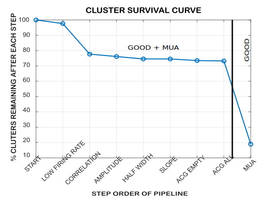

Gives us the percentage of units survived after each step, plotted againts that step label.


**Figure2: Radar Plot-Good+MUA (Biological Clusters):** 

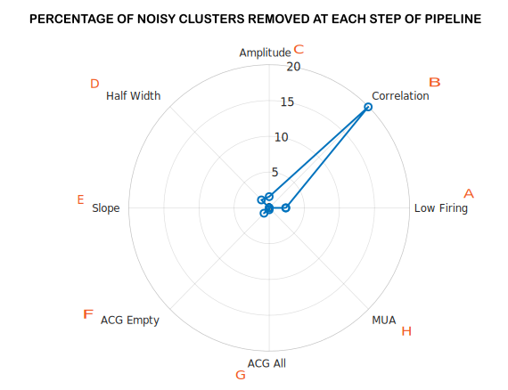

Percentage of noisy clusters removed at each step of the SpikeCleaner pipeline. The correlation-based filter removes the largest fraction of non-neuronal clusters, while waveform-shape metrics (amplitude, half-width, slope) and ACG-based criteria contribute smaller incremental refinements. This indicates that cross-channel similarity is the dominant signature of noise in the dataset.


**Figure3: Radar Plot-Good/Single Units**

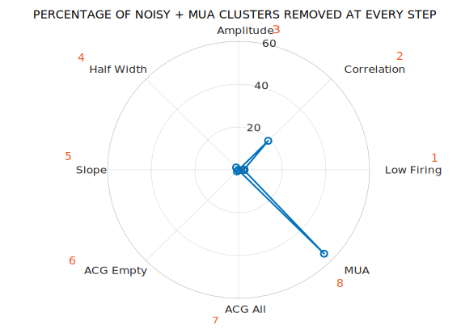

Percentage of noise and multi-unit activity (MUA) clusters removed at each step of the SpikeCleaner pipeline during isolation of single units. The MUA rejection step accounts for the largest reduction, while correlation filtering provides an earlier coarse separation of non-physiological clusters. Waveform-shape and ACG-based criteria contribute smaller refinements.


**Figure4: Pipeline Step-wise Statistics**
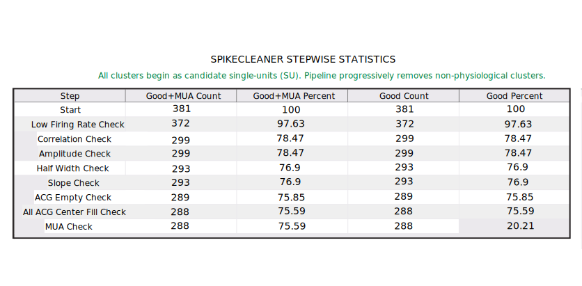

### Comparing SpikeCleaner to User Curation:
1. Go ahead and open PHY from within the SpikeCleaner folder and Curate the clusters into : Noise,Good,MUA. Don't go ahead with split and merge just yet.
2. From inside the SpikeCleaner/ call dz_allCats(), dz_goodvsRest(),dz_neuronalVsNN(). Each of them is going to ask you to enter the user name so that it can rename your recent curation file in PHY: `cluster_group.tsv` to `cluster_group_username.tsv`. This would make your name appear as the column header for your curations when you reopen PHY, to avoid any confusions.
3. This is also going to output in SpikeCleaner/ : `allcat_username.tsv`, `GoodVsRest_username.tsv`& `NvsNN_username.tsv` which are MATCH/No MATCH metrics for each of the categories. This would enable user to easily navigate and sort in PHY.
4. This would also output metrics like Accuracy,Precision,Recall & F1 for each of the categories between user and SpikeCleaner in `SpikeCleaner/Accuracy/`.

### Deciding on your own Thresholds(`FindThresholds/`)
If and when user thinks the standard thersholds are working very well for their curations by referring to the Accuracy Metrics produced in the previous step, user can find the appropriate thresholds for their data.

For threshold check, user need to call the functions in an order and update the threshold from the previous checks to the next level of check.

1. **findCorrelationThreshold()**: Call this function from the data folder, where you can see already see the subfolder for **SpikeCleaner**. This function runs the entire algorithm for all the correlation thresholds and saves the **cluster_Spikereasons.tsv** for each run in **Correlation/** and compares the user curations to them, to match which threshold makes the user curations most like the algorithm curations. We compare when ever algorithm thinks the cluster is Noisy because of Correlation threshold, i.e, when maximum spike channel is too correlated to all other channels, and match that to when ever user thinks its Noisy. We want to find the threshold that can maximize the matches. 
This function will plot and save the %Matches Vs Thresholds in the **Correlation/**
You can refer to the plot below to understand how to choose thresholds on your own data. Once you have the thershold use that for running the next steps.

**Figure5: Correlation Threshold Plot**
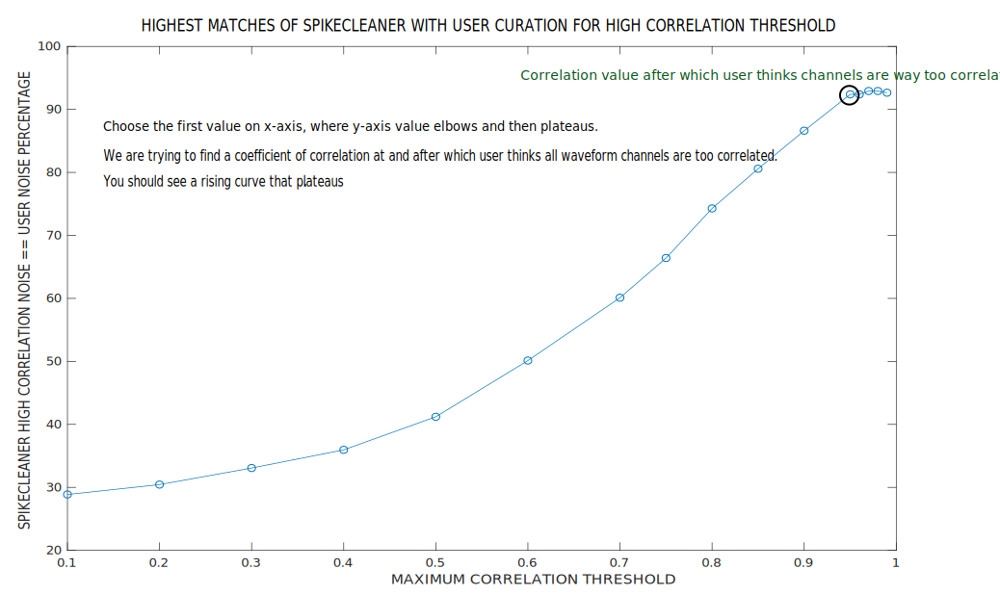

2. **findAmplitudeThreshold()**: Open the function and edit the value of correlation thershold that you found from the previous step. 
Call this function from the data folder, where you can see already see the subfolder for **SpikeCleaner**. This function runs the entire algorithm for all the half-width thresholds and saves the **cluster_Spikereasons.tsv** for each run in **Amplitude/** and compares the user curations to them, to match which threshold makes the user curations most like the algorithm curations. We compare when ever algorithm thinks the cluster is Noisy because of amplitude difference between channels, i.e, amplitude difference between near by channels is too high, one channel might be abnormally huge, and match that to when ever user thinks its Noisy. We want to find the threshold that can maximize the matches. 
This function will plot and save the %Matches Vs Thresholds in the **Amplitude/**
You can refer to the plot below to understand how to choose thresholds on your own data. Once you have the threshold use that for running the next steps.

**Figure6: Amplitude Threshold Plot**
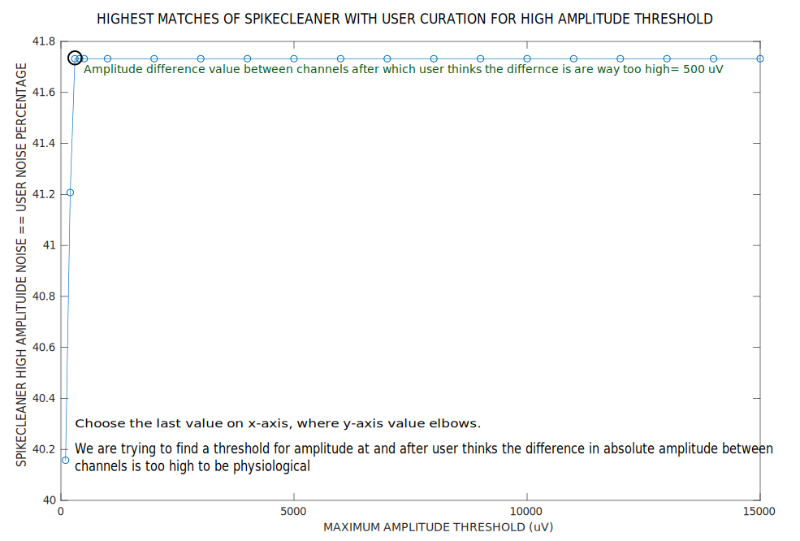

3. **findHalfWidthThreshold()**: Open the function and edit the value of amplitude thershold that you found from the previous step. 
Call this function from the data folder, where you can see already see the subfolder for **SpikeCleaner**. This function runs the entire algorithm for all the half-width thresholds and saves the **cluster_Spikereasons.tsv** for each run in **HalfWidth/** and compares the user curations to them, to match which threshold makes the user curations most like the algorithm curations. We compare when ever algorithm thinks the cluster is Noisy because of half-width threshold, i.e, halfwidth too wide for the spike to be physiological, and match that to when ever user thinks its Noisy. We want to find the threshold that can maximize the matches. 
This function will plot and save the %Matches Vs Thresholds in the **HalfWidth/**
You can refer to the plot below to understand how to choose thresholds on your own data. Once you have the thershold use that for running the next steps.

**Figure7: Half-Width Threshold Plot**
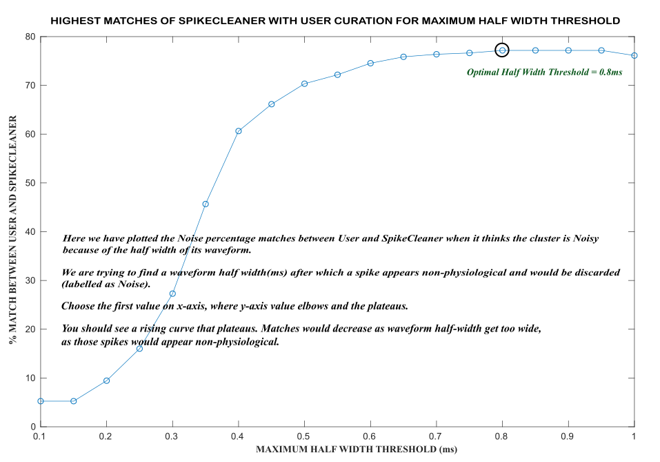

4. **findSlopeThreshold()**: Open the function and edit the value of half-width threshold that you found from the previous step. 
Call this function from the data folder, where you can see already see the subfolder for **SpikeCleaner**. This function runs the entire algorithm for all the slope thresholds and saves the **cluster_Spikereasons.tsv** for each run in **Slope/** and compares the user curations to them, to match which threshold makes the user curations most like the algorithm curations. We compare when ever algorithm thinks the cluster is Noisy because of slope threshold, i.e, slope being too low,spike waveform being too slow to be physiological, and match that to when ever user thinks its Noisy. We want to find the threshold that can maximize the matches. 
This function will plot and save the %Matches Vs Thresholds in the **Slope/**
You can refer to the plot below to understand how to choose thresholds on your own data. Once you have the threshold use that for running the next steps.

**Figure8: Slope Threshold Plot**
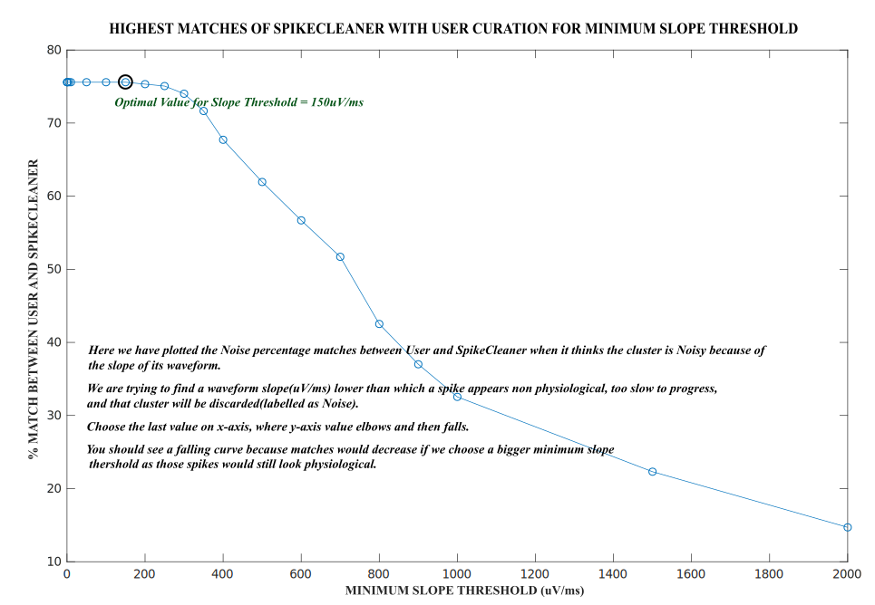

5. **findACGallThreshold()**: Open the function and edit the value of slope threshold that you found from the previous step. 
Call this function from the data folder, where you can see already see the subfolder for **SpikeCleaner**. This function runs the entire algorithm for all the ACGall thresholds and saves the **cluster_Spikereasons.tsv** for each run in **ACGall/** and compares the user curations to them, to match which threshold makes the user curations most like the algorithm curations. We compare when ever algorithm thinks the cluster is Noisy because of ACGall threshold, i.e, all ACG bins are above a certain percentage of the side bins/should bins, ACG is too filled, and match that to when ever user thinks its Noisy/MUA. Also calculate if user thinks this condition is Noise/MUA. We want to find the threshold and curation label that can maximize the matches. 
This function will plot and save the %Matches Vs Thresholds in the **ACGall/**
You can refer to the plot below to understand how to choose thresholds and labels on your own data. Once you have the threshold use that for running the next steps.

**Figure9: ACGall Threshold Plot**
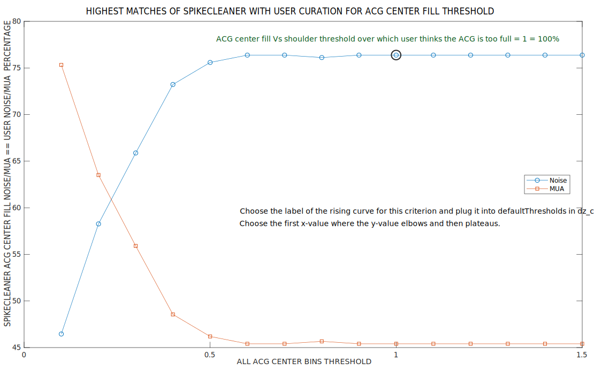

Once you have all the thresholds go back and edit the **dz_classifyUnitsAll()** and re-run teh entire algorithm with the upadted thresholds.


## Outputs

### TSV Files (Data folder)
All TSV file outputs (`cluster_SpikeCleaner.tsv`, `cluster_Spikereasons.tsv`,`halfwidths.tsv`, `slopes.tsv`, `correlation.tsv`, `amplitudes.tsv`, `GoodvsRest_username.tsv`,`allcat_username.tsv`, `NvsNN_username.tsv` ) are created in the SpikeCleaner folder within the Data folder, which is required to be able to access in PHY.

### MAT Files (Outputs folder)
All MAT file outputs (`datfilename.mat`, `datfilename_filtered.mat`, `datfilenameacg.mat`) are created in the Outputs folder in the SpikeCleaner directory.

## Usage

1. Open your data folder that will be your base folder
2. Add SpikeCleaner to path.
3. Call `dz_runFirst()`
4. Call `dz_ClassifyUnitsAll()` and adjust thresholds as needed. The first run would take a very long time because SpikeCleaner would make ACGs and extract waveforms for every cluster and save them in a mat file, every subsequent run would be a few seconds long.
5. Open PHY for manual curation with SpikeCleaner folder as the base.
6. Run Accuracy metrics with SpikeCleaner folder as the base.

## Results

**Figure10: PHY View: Autocorrelogram Classification: It uses shoulder peaks to get the proportions of violations in the center.**

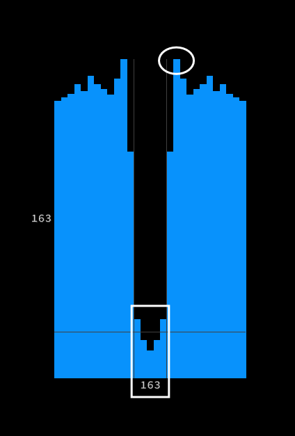

**Figure11: PHY View: Depicts the view in PHY after importing results from SpikeCleaner.
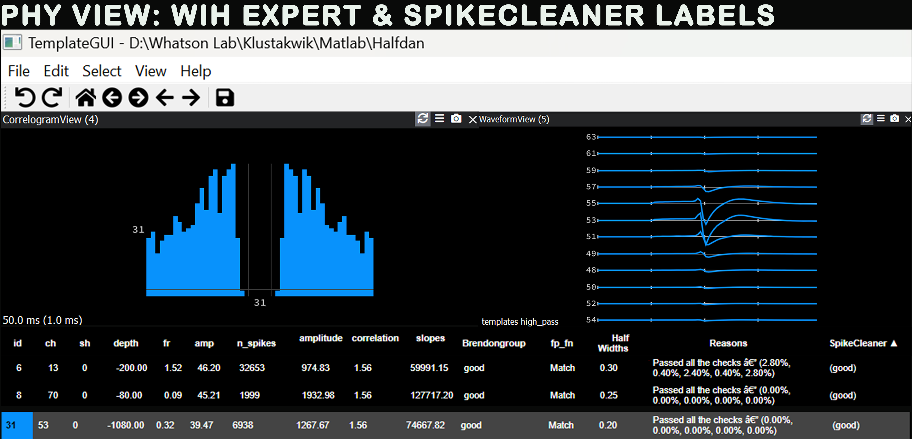

**Figure12: Journey to Acceptance:Shows implementations of all the thresholding rules consecutively to obtain Single Units.**
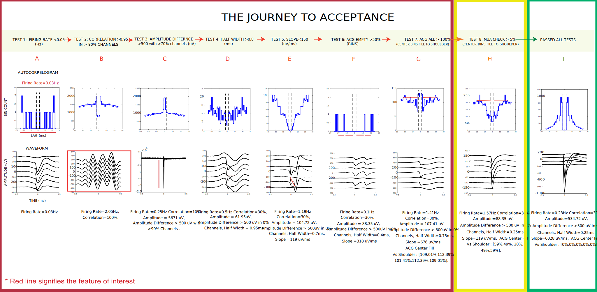

## Metrics of Match with Expert Users

**Rodents-Grass Rats:** Harald,Hafdan,Canute 
**Neural Recording Information:**

Recording Size: 102 GB

Channels: 128 Channels

Sampling Rate: 20KHz 

Calculated Time: ~5.5 hours long.

**Results were averaged over 2 experts and 3 data sets:**

**Figure13: Metrics Single Units Vs Rest between the algorithm and experts users**
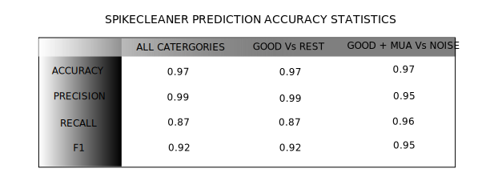

## Acknowledgements

Special thanks to  the expert curators: Dr. Brendon Watson & Dr. Jeremiah Hartner.

This work builds on open-source tools such as [Kilosort](https://github.com/MouseLand/Kilosort) and [Phy](https://github.com/cortex-lab/phy).


